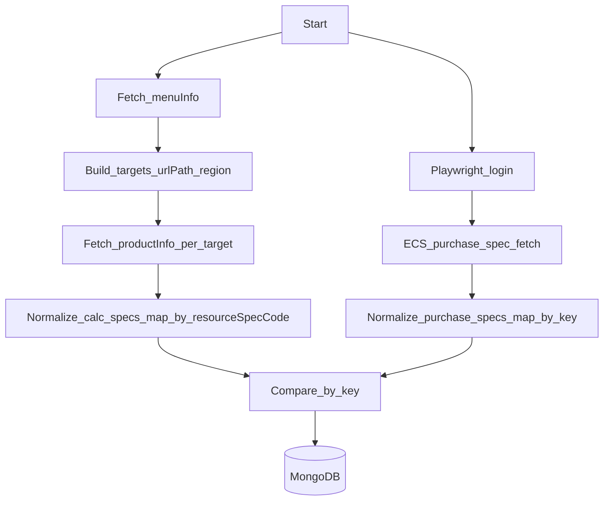

## 目标

- 在抓取价格计算器规格前，**先请求 menu 接口**获取可计算的产品（urlPath）及在线区域（regionList）。
- 对每个可用的 `urlPath + region` 请求价格计算器规格接口 `productInfo`，把规格归一化后按 `**resourceSpecCode`** 建索引。
- 登录必须使用浏览器自动化（**Playwright**）获取鉴权态（cookies/headers），再用同一鉴权会话请求购买页规格接口。
- 因“不同服务购买页/规格接口/响应结构不同”，对比逻辑按服务拆分：`adapters/ecs/`*、`adapters/hcss/`*… 第一阶段先完成 `ecs`。

## 关键接口与解析约定

- **menuInfo（先调用）**
  - URL：`GET https://portal.huaweicloud.com/api/calculator/rest/cbc/portalcalculatornodeservice/v4/api/menuInfo?sign=common&language=zh-cn`
  - 解析要点：
    - 遍历 `menuInfos[].subCategoryLists[]`
    - 过滤：`hasCalculator=true && hideCalculator=false`
    - 取 `urlPath` 作为计算器产品标识；如存在 `associateList`，可作为同类 urlPath 别名/补充（先只用主 `urlPath`，保留扩展点）
    - 取 `regionOnline.regionList[]` 作为在线区域集合
- **productInfo（计算器规格）**
  - URL 模板：`GET https://portal.huaweicloud.com/api/calculator/rest/cbc/portalcalculatornodeservice/v4/api/productInfo?urlPath={urlPath}&tag=general.online.portal&region={region}&tab=calc&sign=common`
  - 解析要点：
    - 核心规格在 `product` 下（示例：`product.ec2_vm[]`），其中每条含 `resourceSpecCode`、`cloudServiceType`、`resourceType`、`productSpecSysDesc` 等
    - **计算器侧索引键**：`resourceSpecCode`（同时保留 `cloudServiceType/resourceType` 以便后续做更稳健的组合键）
- **购买页规格接口（ECS 第一阶段）**
  - 由于你目前不确定购买页响应里的“规格码字段”，实现策略：
    - ECS 专用适配器 `extractPurchaseSpecKey()`：优先从响应中探测常见字段（如 `resourceSpecCode/specCode/skuCode/sku/instanceType` 等），并支持在配置中指定 JSONPath/字段路径覆盖
    - 若仍无法提取主键：将该条记录标为 `unmatched_key` 并落库保留原始片段，便于快速调整解析规则（不阻塞整体跑通）

## 建议的数据流（更新后的抓取流程）

## 代码结构（按“服务适配器”拆分）

- 复用现有工程入口（当前 `page_diff_crawler.js` 为空/占位，README 也为空，需要补齐运行方式）
- 建议新增（路径仅建议，按你项目习惯调整）：
  - `src/config.ts`：menu/productInfo 基础参数（sign/language/tag/tab）、目标服务（第一期 ecs）、Mongo、登录信息
  - `src/calc/menu.ts`：请求与解析 `menuInfo` → 输出 `{ urlPath, regions }[]`
  - `src/calc/productInfo.ts`：请求 `productInfo(urlPath, region)` → 输出原始 JSON
  - `src/calc/normalize.ts`：把 `productInfo` 响应归一化为 `Map<resourceSpecCode, CalcSpec>`
  - `src/auth/playwrightLogin.ts`：Playwright 登录 → 输出 `cookies` / `storageState` / `extraHeaders`
  - `src/adapters/ecs/purchaseFetch.ts`：在已登录态下请求 ECS 购买页规格接口（第一期只写 ECS）
  - `src/adapters/ecs/normalize.ts`：归一化 ECS 购买页规格为 `Map<key, PurchaseSpec>`
  - `src/compare/diff.ts`：集合 diff（only_in_calc / only_in_purchase / both）+ 字段 diff
  - `src/persist/mongo.ts`：写入 `spec_diff_runs`（或你指定集合）
  - `src/runSpecDiff.ts`：主流程：menu → productInfo → normalize(calc) → login → fetchPurchase(ecs) → normalize(purchase) → compare → persist

## 对比输出与落库（保留“无法匹配主键”的可诊断信息）

- run 文档建议：
  - `runAt`
  - `calcTargets`: 计算器抓取覆盖的 `{urlPath, region}` 列表与统计
  - `service`: `ecs`
  - `keyStrategy`: `calc=resourceSpecCode, purchase=autoDetect|overridePath`
  - `summary`: counts
  - `byKey`: `{ [key]: { calc, purchase, fieldDiffs, status } }`
  - `unmatchedPurchaseSamples`: 购买页侧无法提取 key 的样本（截断）

## 实施步骤（最小可用优先）

- **Step A（计算器侧改造）**：实现 `menuInfo` 抓取与解析 → 构建 targets → 并发/限速抓取 `productInfo`（按 `{urlPath, region}`）→ 归一化为 `Map<resourceSpecCode, CalcSpec>`。
- **Step B（Playwright 登录）**：接入 Playwright，完成登录并导出 `storageState` 或 cookies，确认后续 HTTP 请求可复用登录态。
- **Step C（ECS 购买页抓取 + 归一化）**：先只实现 ECS 的购买页 spec 抓取与 normalize；实现 key 自动探测 + 可配置覆盖路径。
- **Step D（对比与落库）**：按 key 做集合差异与字段差异，写入 MongoDB，输出摘要到控制台。
- **Step E（扩展点）**：增加 `adapters/{service}` 目录与注册表，后续按服务逐个接入不同购买页接口与解析逻辑。

## 需要你补充/我将采用的默认值

- **默认值**：`sign=common`、`language=zh-cn`（menu）、`tag=general.online.portal`、`tab=calc`（productInfo），如后续发现随区域/站点变化再参数化。
- **ECS 购买页规格接口**：本 plan 假设你会提供 ECS 购买页的 spec API（URL + 请求方法 + 示例响应/关键字段）。如果你暂时没有，我会先把适配器骨架与“从页面/网络请求中抓取接口”的定位步骤写进实现说明，但真正落地仍需要一个可调用的 ECS spec API。

