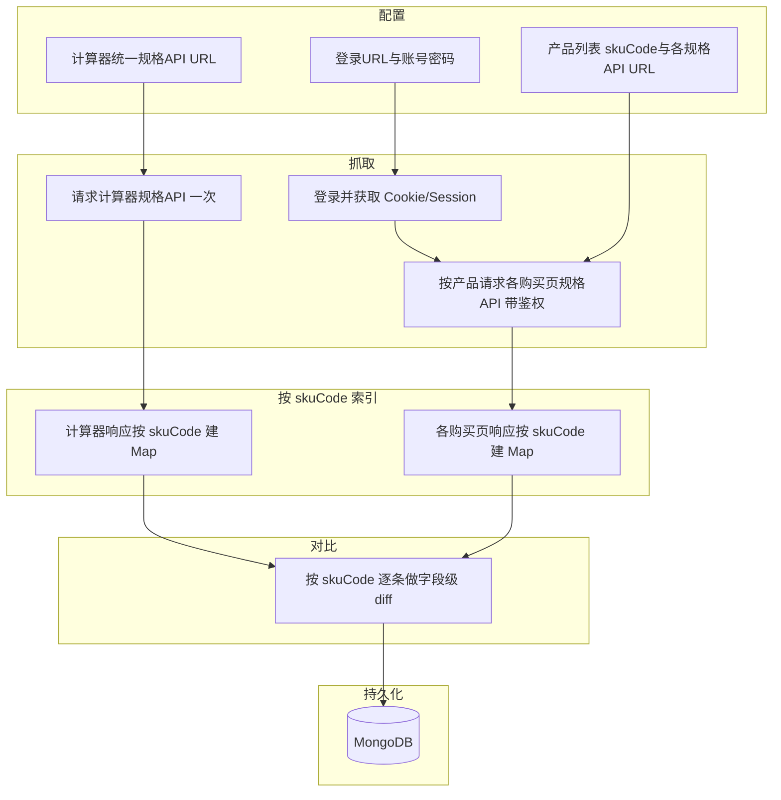

# 规格接口对比爬虫 - 需求与方案

## 需求整理

| 项目    | 说明                                                                      |
| ----- | ----------------------------------------------------------------------- |
| 数据源 A | **价格计算器页面**：一个统一接口获取所有产品的规格（一个 API URL，返回多产品）                           |
| 数据源 B | **各产品购买页**：每个产品有独立购买页 URL，且每个产品有独立的规格接口 URL；访问前需**先登录**，登录后请求各产品配置的规格接口 |
| 对比维度  | **仅按产品的 skuCode 对比**（同一 skuCode 在计算器接口与购买页接口中的规格数据做差异对比）                |
| 技术    | Node.js，请求规格接口获取 JSON，对比后存入 MongoDB                                     |

要点：计算器侧一次请求统一接口即可拿到所有产品规格，需在响应中按 skuCode 索引；购买页侧先执行登录，再用同一会话依次请求每个产品配置的规格接口 URL，用 skuCode 与计算器侧对齐后对比。

## 架构示意

- **配置**：计算器统一规格 API URL；登录 URL、方法、账号密码；产品列表（每项含 skuCode、购买页 URL、该产品规格接口 URL）；MongoDB 连接串。
- **抓取**：先请求计算器 API 一次得到全部规格；执行登录获取 Cookie/Token；用同一会话依次请求各产品的规格接口。
- **对比**：仅按 **skuCode** 对齐；计算器侧与购买页侧均按 skuCode 索引后，逐条做字段级 diff。
- **存储**：每次运行写入一条记录，含 runAt、摘要、按 skuCode 的对比明细（仅计算器有 / 仅购买页有 / 字段差异）。

## 对比逻辑（仅按 skuCode）

- **主键**：固定为 `skuCode`（字段名可配置，如 `skuCode` / `sku_code`）。
- **计算器侧**：解析统一接口响应，将列表转为 `Map<skuCode, 规格对象>`。
- **购买页侧**：每个产品请求一次规格接口，解析后放入 `Map<skuCode, 规格对象>`。
- **逐 skuCode 对比**：仅计算器有 → `onlyInCalculator`；仅购买页有 → `onlyInPurchase`；两边都有 → 做字段级 diff，得到 `fieldDiffs[skuCode]`。
- 输出统一结构便于写入 MongoDB，例如：`{ onlyInCalculator, onlyInPurchase, bySkuCode: { [skuCode]: { calculatorSpec, purchaseSpec, fieldDiffs } }, summary }`。

## 登录与请求实现方式

- **若登录为表单 POST 且响应 Set-Cookie**：用 axios 先 POST 登录，保存 Cookie，后续所有购买页规格接口请求复用同一 Cookie。
- **若登录依赖浏览器**（OAuth、验证码等）：可引入 Puppeteer/Playwright，完成登录后从浏览器取 Cookie，再在 Node 里用 axios 带 Cookie 请求各 specApiUrl。方案中预留登录模块抽象，便于从 axios 切换为无头浏览器。

## 项目改动范围

- **新增**：规格接口对比流程（与现有页面 HTML 对比逻辑并存）。
- **依赖**：现有 `axios`；新增 `mongodb`；若需无头浏览器登录则新增 `puppeteer` 或 `playwright`。

### 建议目录与文件

- `config/spec-crawler.js` 或 `spec-crawler.config.json`：计算器 API、登录配置、产品列表（skuCode / purchasePageUrl / specApiUrl）、MongoDB 连接与集合名。
- `lib/login.js`：登录逻辑（axios 或 playwright），返回可供 axios 使用的 Cookie/Header。
- `lib/spec-fetcher.js`：请求计算器统一接口；用已登录会话请求各产品购买页规格接口。
- `lib/spec-diff.js`：按 skuCode 索引两份数据，逐条做字段级 diff，输出统一结构。
- `spec-api-crawler.js` 或 `scripts/run-spec-diff.js`：串联 登录 → 拉取计算器 + 各产品规格 → diff → 写入 MongoDB；支持单次运行或定时任务。
- 可选：在 README 中增加“规格接口对比”的配置说明与运行方式。

### MongoDB 存储建议

- **集合名**：如 `spec_diff_runs`。
- **文档字段建议**：
  - `runAt`: Date
  - `calculatorApi`: string
  - `productsCount`: number
  - `summary`: { onlyInCalculator, onlyInPurchase, withFieldDiffs, match }
  - `bySkuCode`: object，key 为 skuCode，value 为 `{ calculatorSpec, purchaseSpec, fieldDiffs, status }`（status 如 only_in_calculator / only_in_purchase / matched / differ）
  - 可选：原始响应按需截断或单独集合存储。

## 实施顺序建议

1. 配置模块：读取计算器 API、登录信息、产品列表（skuCode + specApiUrl）、MongoDB，支持环境变量覆盖。
2. 登录模块：实现基于 axios 的登录并带回 Cookie；若不够用再接入 Puppeteer/Playwright。
3. 抓取模块：请求计算器 API；用登录后的会话依次请求各产品 specApiUrl；将两路数据按 skuCode 整理为 Map。
4. 对比模块：按 skuCode 做集合 diff + 字段级 diff，输出统一结构。
5. 主流程：串联上述步骤，将结果写入 MongoDB，并加 CLI 入口与 npm script。
6. 文档：在 README 中补充配置项说明、产品列表格式、仅按 skuCode 对比的约定。

## 实现时需您提供的细节

- 计算器统一规格接口的 **URL** 与 **响应结构**（如 data.list[] 下每条是否含 skuCode，字段名是 skuCode 还是 sku_code）。
- 登录方式：**URL、方法、请求体格式**，以及是否必须用浏览器（验证码/跳转）。
- 产品列表示例：至少 1～2 条产品的 skuCode、purchasePageUrl、specApiUrl。
- 购买页规格接口的 **响应结构**（单条规格对象还是列表，如何与 skuCode 对应）。
- 规格对象中哪些字段需要参与对比（若全部则做全字段 diff；若仅部分则可在配置中列白名单）。